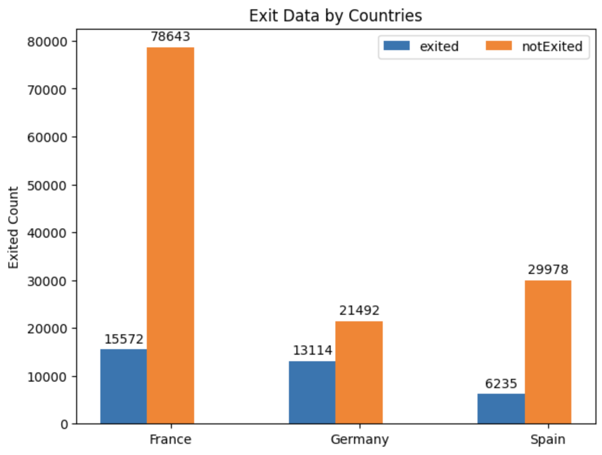

# Binary Classification with a Bank Churn Dataset 

Goal: To predict whether a customer continues with their account or closes it (e.g. churns)

## Data Information:

Data Files: data.csv

Features:
- id: int64
- CustomerId: int64
- Surname: object
- CreditScore: int64
- Geography: object
- Gender: object
- Age: float64
- Tenure: int64
- Balance: float64
- NumOfProducts: int64
- HasCrCard: float64
- IsActiveMember: float64
- EstimatedSalary: float64
- Exited: int64

## Data Preprocessing

- Dropped the following columns:
    - id
    - CustomerId
    - Surname

## Data Analysis

- Data Correlation Matrix
- Exit Data by Countries
    - France has the highest number of people who did not exit the bank but also
    has the highest number of people who exited
    - The customer base of the bank is very low in Germany and Spain compared to France but has a lower churn rate
- The average age of a customer who exited is 37.63 years. Given the lowest age to be 18 and the highest age of a customer to be 92, it shows that a lot of young people are exiting
- The minimum credit score in the bank is 350 and the maximum credit score is 850. The average credit score of a customer who exited is 652.22. Customers with credit score on the higher side are leaving the bank

## Data Preparation

- There are no null values in the data
- Categorical Variables of "Gender" and "Geography" are one-hot encoded

## Model Training

- Two models are tested: Logistic Regression and XGBoost Classifier
- Logistic Regression:
    - Precision: 0.4936945352638954
    - Recall: 0.1218162959548231
    - F1 Score: 0.19541504899242004
    - Accuracy: 0.7890399670374949
- XGBoost Classifier:
    - Precision: 0.7442648190916089
    - Recall: 0.5571049902039875
    - F1 Score: 0.6372264698128131
    - Accuracy: 0.8665988026854747
- The XGBoost Classifier performs well on the data and hence can be deployed for classification in the future

## Insights

- The bank can increase its presence in Spain and Germany
- Lucrative schemes can be brought up for the younger population
